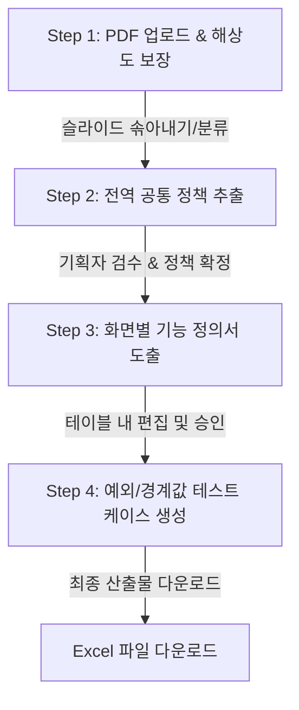

# 📋 테스트 산출물 자동 생성 시스템 (Test Artifact Auto-Generation System)


현대 소프트웨어 개발 주기에서 가장 심각한 병목이 발생하는 **"기획 설계서의 잦은 변경에 따른 QA 산출물(테스트 시나리오 및 케이스)의 수동 갱신 및 동기화 작업"** 을 해결하기 위해 개발된 인공지능 기반 자동화 시스템입니다.

PDF 형태의 화면 설계서(UI 기획서)를 입력받아 화면의 구성과 비즈니스 논리를 지능적으로 추론하고, 최종적으로 **엑셀 규격에 맞춘 기능 정의서 및 품질 검증용 통합 테스트 케이스를 5분 이내로 자동 추출 및 설계** 해 줍니다. 

---

## 🌟 핵심 도입 효과
* ⏱️ **작업 시간 80% 단축:** 화면당 평균 30분 걸리던 QA 케이스 설계 작업을 5분(AI 도출 2분 + 인간 검수 3분) 이내로 절감합니다.
* 🛡️ **누락 없는 철저한 품질 검증:** 인간의 피로도로 인해 놓치기 쉬운 경계값 분석(Boundary Value Analysis) 및 극단적인 예외 흐름(오류 상황 등)에 대한 테스트 케이스를 AI가 강제 설계하여 결함 누락률을 5% 미만으로 억제합니다.
* 💬 **의사소통 비용 50% 절감:** 기획자, 개발자, QA 담당자가 시스템이 자동 도출하고 인간이 검수한 단일화된 표 데이터를 기반으로 커뮤니케이션하여 불필요한 마찰을 차단합니다.

---

## 🔄 주요 기능 및 작업 워크플로우 (4단계 선형 구조)
본 시스템은 직관적인 사용자 경험(UX)과 안정성을 극대화하기 위해 명확한 선형 단계로 구동됩니다.



### 1️⃣ Step 1. 파일 업로드 및 분석 대상 솎아내기
* PDF 문서를 이미지(300 DPI 이상)로 자동 분할하여 미세한 지시선이나 글자까지 시각 언어 모델이 인지할 수 있게 변환합니다.
* 전체 슬라이드 미리보기를 제공하며, 사용자가 **공통 정책 / 분석 대상 화면 / 제외 슬라이드** 를 직접 지정하여 불필요한 AI 연산 비용을 획기적으로 차단합니다.

### 2️⃣ Step 2. 공통 정책 추출 및 사용자 1차 검수
* 공통 정책 슬라이드를 분석하여 시스템 전체를 관통하는 전역 지침(예: 공통 비밀번호 조합 규칙, 네트워크 지연 대처 방안, 세션 만료 시간 등)을 요약 도출합니다.
* 텍스트 편집기를 통해 기획자가 직접 내용을 검수하고 수정/보완할 수 있게 하여 후속 단계의 연쇄적인 분석 오류를 철저히 예방합니다.

### 3️⃣ Step 3. 화면별 기능 정의서 도출 (Interactive Data Editor)
* 개별 화면 이미지와 1차 확정된 공통 정책을 결합하여, **비즈니스 목적 유추 ➔ 지시선 번호 1:1 매핑 ➔ 숨겨진 기능 도출 ➔ 누락 점검 자가진단** 의 다면적인 분석을 수행합니다.
* 화면에 Excel과 유사한 인터페이스(Streamlit Data Editor)를 제공하여 사용자가 열 너비 조절, 더블 클릭 수정, 행 추가/삭제를 자유롭게 수행하며 기능 정의서의 논리적 무결성을 완성합니다.

### 4️⃣ Step 4. 테스트 케이스 자동 생성 및 엑셀 이관
* 최종 승인된 기능 정의서를 바탕으로 동등 분할(Equivalence Partitioning) 및 경계값 분석(Boundary Value Analysis) 기법을 흉내 낸 테스트 시나리오를 설계합니다.
* 기능당 **정상 흐름 1개 + 예외/경계값 흐름 2개 이상** 을 강제 배정하여 촘촘한 테스트망을 구축하고, 완성된 산출물은 사내 표준 스타일(회색/청색 배경 서식)이 입혀진 고품질 Excel 파일로 제공합니다.

---

## 🛠️ 핵심 기술 혁신 및 안정성 설계 (Technical Highlights)

### ⚡ Asyncio 기반 비동기 병렬 처리
* 순차적으로 분석하던 기존 아키텍처를 `asyncio` 라이브러리를 활용해 완전한 비동기 병렬 구조로 대폭 개선했습니다. 
* 이를 통해 수십 장에 달하는 문서를 한 장 처리하는 시간 수준으로 대폭 단축하여 극적인 속도 향상을 이루어냈습니다.

### 🎯 Structured Outputs (Pydantic 강제) 적용을 통한 오류 제어
* LLM 특유의 불완전한 JSON 응답 문제를 해결하기 위해, OpenAI의 최신 `Structured Outputs` API와 `Pydantic` 스키마 제약을 의무 적용했습니다.
* 인사말이나 불필요한 대괄호 누락 등으로 발생하던 파싱 오류(Parsing Error) 발생률을 원천적으로 **0%** 로 수렴시켰습니다.

### 🛡️ API Rate Limit 및 비용 최적화
* 대규모 요청 시 발생하는 API `429 (Too Many Requests)` 오류를 방지하기 위해 **비동기 세마포어(Semaphore) 동시 실행 제어** 와 지수 백오프 기반의 자동 재시도(`tenacity` 활용) 방어벽을 설계했습니다.
* 무거운 고해상도 이미지를 그대로 전송하지 않고 비율을 유지하며 최대 2000px로 스마트 리사이징하여 토큰 낭비와 응답 대기 시간을 혁신적으로 줄였습니다.

### 🔒 제로 트러스트(Zero Trust) 무상태 보안 아키텍처
* 기업의 비밀 자산인 화면 설계서 유출을 방지하기 위해 데이터베이스나 클라우드 저장소를 일절 사용하지 않는 무상태(Stateless) 아키텍처로 구현되었습니다.
* 세션 종료 혹은 일정 시간 동안 사용자의 조작이 감지되지 않으면 운영체제 수준에서 할당되었던 임시 폴더와 메모리의 관련 모든 파편 데이터를 **물리적으로 즉시 영구 파기** 하여 외부 유출을 원천 차단합니다.

### 🧩 관심사 분리(SoC) 및 유지보수성 극대화
* 모놀리식 구조였던 코드를 서비스(`llm_service.py`), 스키마 정의(`schemas.py`), 기획자 프롬프트 팩토리(`prompts.py`)로 완벽히 리팩토링했습니다.
* `Enum`을 활용한 UI 단계 상태 전이(`AppStep`), 깊은 예외 추적 및 디버깅을 위한 `logging` 파일(`app.log`) 연동, IDE 자동완성 극대화를 위한 `typing` 모듈의 철저한 타입 힌트가 적용되었습니다.

---

## 📂 프로젝트 디렉토리 구조
```text
pj1/
├── app.py                  # Streamlit UI 렌더링 및 메인 애플리케이션 흐름 제어
├── llm_service.py          # OpenAI API 연동 및 비동기 LLM 호출 비즈니스 로직
├── schemas.py              # Pydantic 기반의 엄격한 데이터 유효성 검증 스키마
├── prompts.py              # 기획/QA 설계자가 작성한 프롬프트 팩토리
├── excel_generator.py      # Pandas & openpyxl 기반의 정형화된 Excel 테마 렌더링 엔진
├── pdf_processor.py        # PyMuPDF 기반 고해상도 슬라이드 분할 및 이미지 처리 엔진
├── file_manager.py         # 임시 보안 폴더 생명주기 및 물리적 파일 쓰기 관리 유틸
├── requirements.txt        # 프로젝트 실행을 위한 의존성 패키지 명세
├── .env                    # OpenAI API Key 저장 환경변수 파일
└── app.log                 # 시스템 디버깅 및 에러 추적을 위한 로컬 로그 파일
```

---

## 🚀 시작 가이드 (Getting Started)

### 1. 사전 요구사항 (Prerequisites)
* Python 3.8 이상 설치 권장
* OpenAI API Key 발급 필요

### 2. 가상환경 구축 및 의존성 설치
```bash
# 가상환경 생성 (선택 사항)
python -m venv venv
source venv/Scripts/activate  # Windows 환경
# venv\Scripts\activate.ps1   # PowerShell 환경

# 필수 라이브러리 패키지 설치
pip install -r requirements.txt
```

### 3. 환경 변수 설정
프로젝트 루트 폴더에 `.env` 파일을 생성하고 아래와 같이 OpenAI API Key를 설정합니다.
```env
OPENAI_API_KEY=your_openai_api_key_here
```

### 4. 애플리케이션 실행
```bash
streamlit run app.py
```
로컬 서버가 구동되면 브라우저에서 `http://localhost:8501`로 즉시 접속할 수 있습니다.

---

## 💡 향후 시스템 고도화 로드맵 (Next Steps)
1. **중간 상태 복구 영속성(Persistence) 확보:** 브라우저 새로고침(F5) 시 세션이 만료되거나 진행 상황이 끊겨도 `session_id` 체크포인트를 바탕으로 작업을 다시 복구할 수 있는 세션 저장 체계 도입.
2. **비즈니스 로직 완전 분리:** `app.py`에 잔존하는 중복 기능 제거 및 자동 맵핑 등의 비즈니스 가공 로직을 별도 모듈로 추가 분리.
3. **Vector DB 및 RAG 도입:** 방대한 공통 정책서를 문단 단위로 쪼개어 가벼운 Vector DB(ChromaDB 등)에 임베딩한 후, 개별 화면 분석 시 매칭률이 높은 관련 정책만 LLM에 주입하여 토큰 낭비 및 비용을 80% 이상 혁신적으로 절감.
4. **Human-in-the-loop (HITL) 테스트 케이스 편집기:** 기능 정의서뿐만 아니라 최종 생성된 테스트 케이스도 엑셀로 내려받기 직전 UI 테이블상에서 실시간 직접 수정할 수 있는 편집 뷰 레이아웃 추가.
